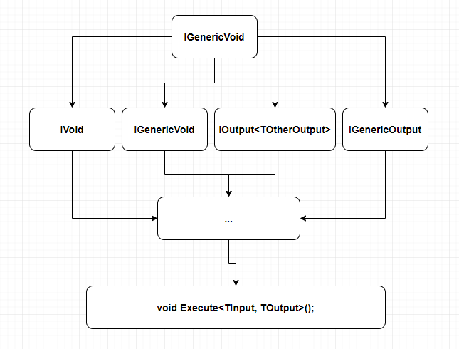

# Chainify

## Flow diagrams

| IVoid | IGenericVoid |
| ------- | ------- |
|  |  |

| IInput | IGenericInput |
| ------- | ------- |
|  |  |

| IOutput | IGenericOutput |
| ------- | ------- |
|  |  |

| IInputOutput | IGenericInputOutput |
| ------- | ------- |
|  |  |
